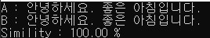
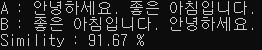
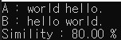
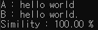

# JaccardSimilarity
유사도 분석, 집합간의 유사도를 검사하는 방법중 하나. 두 집합 A B 사이의 J(A,B)는 두 집합의 교집합 크기 / 두 집합의 합집합 크기로 정의된다. 대략 아래와 같은 느낌이다.

  

문자열 사이의 유사도를 검색하기 위해선, 문자열을 두 글자씩 끊어서 다중 집합을 만든 후 두 집합의 유사도를 측정하면 된다. 예를들어 문자열 "FRANCE"와 "FRENCH"가 주어졌을 때, 각각  {FR, RA, AN, NC, CE}, {FR, RE, EN, NC, CH}가 되며 {FR, NC}, 합집합은 {FR, RA, AN, NC, CE, RE, EN, CH}가 되므로, 두 문자열 사이의 자카드 유사도 J("FRANCE", "FRENCH") = 2/8 = 0.25가 된다.

 
# Results
  
  
  
  
